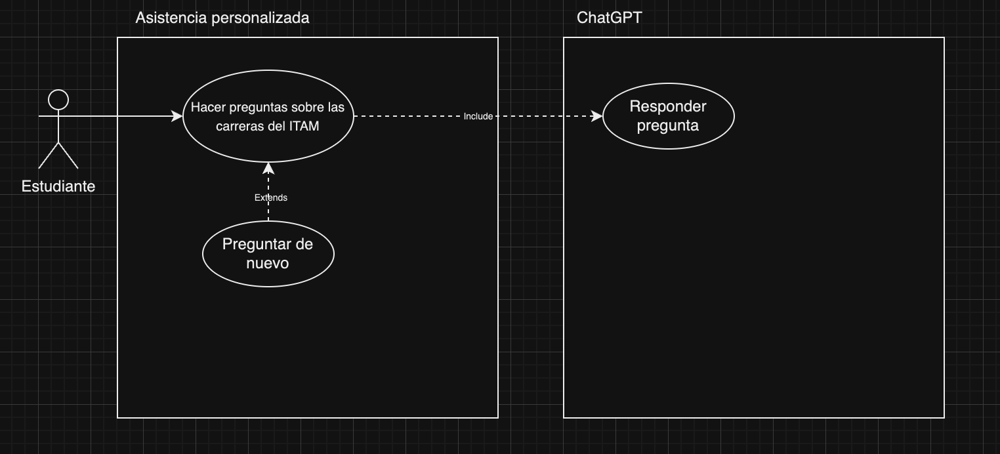
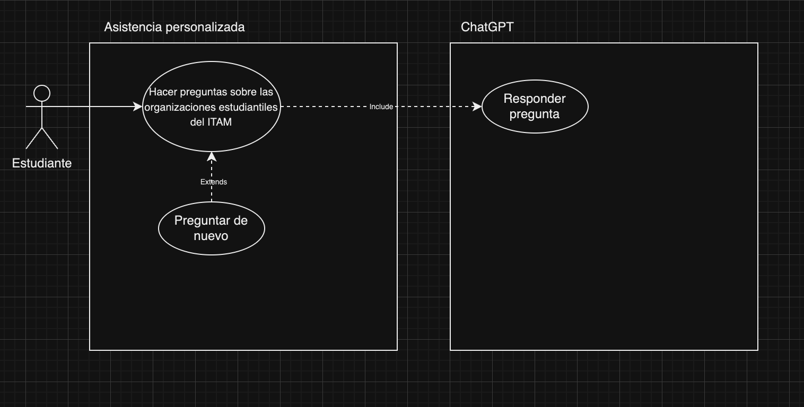
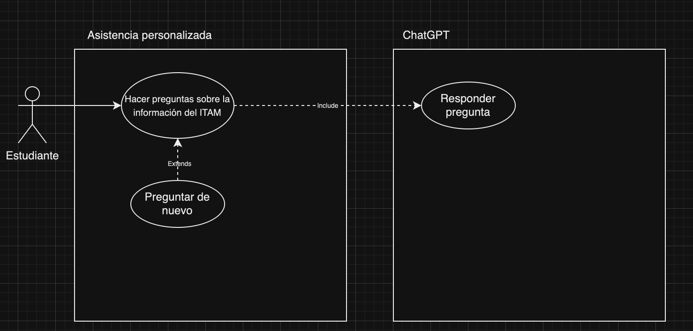
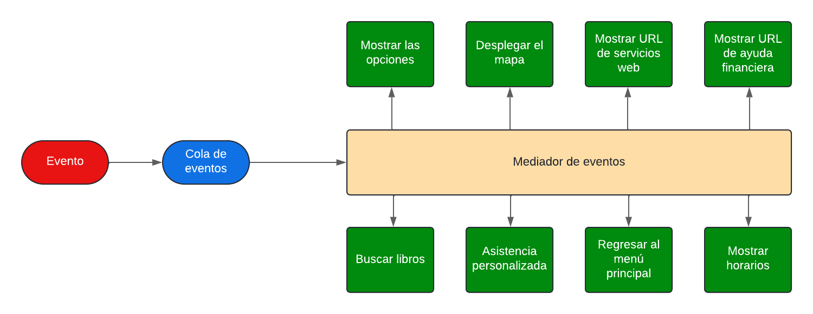
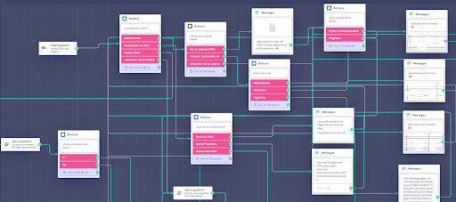
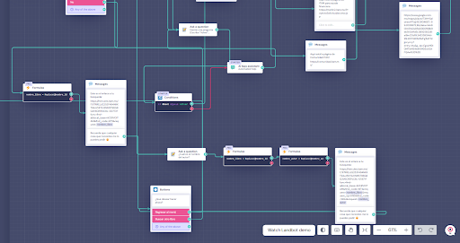

# ProyectoChatBotIS
Proyecto de Ingeniería de Software Otoño 2024. Chatbot para guiar a una persona que acaba de entrar al ITAM

## 1. Software Requirements (Requerimientos de Software)
Aquí defines las funcionalidades y características que debe cumplir el software. Incluyes al menos 3 casos de uso por requerimiento para mostrar cómo interactúan los usuarios con el sistema.

•⁠ **Requerimiento 1:** El sistema permite obtener información sobre las instalaciones.
  - Caso de Uso 1: Consultar información de las instalaciones
  - Caso de Uso 2: Consultar horarios de facultad menor
  - Caso de Uso 3: Consultar ubicación de salones PF

•⁠ **Requerimiento 2:** El sistema permite obtener enlaces a los servicios en línea que ITAM el proporciona.
  - Caso de Uso 1: Consultar información de servicios web
  - Caso de Uso 2: Consultar información de ayuda financiera
  - Caso de Uso 3: Consultar información de Comunidad ITAM

•⁠ **Requerimiento 3:** El sistema facilita la consulta de libros en el portal web de la biblioteca del ITAM
  - Caso de Uso 1: Consultar libros por nombre del libro
  - Caso de Uso 2: Consultar libros por nombre del libro y autor

•⁠ **Requerimiento 4:** El sistema permite a los usuarios interactuar con una inteligencia artificial que les brinda información general sobre el ITAM.
  - Caso de Uso 1: Hacer preguntas sobre la información del ITAM
  - Caso de Uso 2: Hacer preguntas sobre las carreras del ITAM
  - Caso de Uso 3: Hacer preguntas sobre las organizaciones estudiantiles del ITAM

## 2. Plan de Calidad

### **Objetivo del Plan de Calidad**  
El Plan de Calidad tiene como objetivo asegurar que el chatbot cumple con los **requerimientos funcionales**, **no funcionales** y las **expectativas del usuario final**, brindando una experiencia **eficiente**, **intuitiva** y **precisa**.

---

### **Estándares de Calidad**  
Se definirán estándares con base en **ISO/IEC 25010** para la calidad del software:

- **Funcionalidad**: El chatbot debe ofrecer respuestas precisas y alineadas a las preguntas planteadas.  
- **Eficiencia**: Respuesta rápida (menos de 3 segundos en promedio).  
- **Usabilidad**: Interfaz amigable, con navegación intuitiva.  
- **Confiabilidad**: El chatbot debe tener una disponibilidad del 99%.  
- **Mantenibilidad**: Código modular y documentación detallada.  
- **Portabilidad**: Compatible con múltiples dispositivos y navegadores.  

---

### **Criterios de Aceptación**  
El proyecto será considerado exitoso si cumple con los siguientes criterios:

1. **Respuestas adecuadas y funcionales**:  
   - Al menos **90%** de las interacciones cumplen con los flujos diseñados.  
   - Respuestas en menos de **3 segundos**.

2. **Accesibilidad y navegación fluida**:  
   - Las opciones y botones deben funcionar en **todas las plataformas compatibles**.  

3. **Estabilidad del sistema**:  
   - El chatbot no debe presentar **errores críticos** en las pruebas funcionales.  

4. **Documentación técnica completa**:  
   - Entrega del **ReadMe** con instrucciones claras y replicables.  

### Pruebas

| **Tipo de prueba**           | **Descripción**                                              | **Herramienta a usar**       |
|------------------------------|-------------------------------------------------------------|-----------------------------|
| *Pruebas unitarias*          | Evaluar componentes individuales del chatbot.               | Jest, Mocha                 |
| *Pruebas de integración*     | Validar interacciones entre botones y respuestas.           | Postman, Insomnia           |
| *Pruebas funcionales*        | Revisar que los botones y respuestas funcionen correctamente.| Manual / Selenium           |
| *Pruebas de rendimiento*     | Medir tiempos de respuesta y uso de recursos.               | JMeter                      |
| *Pruebas de usabilidad*      | Validar la experiencia del usuario con evaluadores externos.| Feedback en clase           |
| *Pruebas de regresión*       | Asegurar que nuevas funcionalidades no rompan el sistema.   | Git + Test Automáticos      |

### Resultados Esperados

- **Chatbot funcional** y entregado en la fecha establecida.  
- **Disponibilidad**: 99% durante las pruebas finales.  
- **Respuestas precisas** y alineadas al objetivo del ITAM.  
- **Documentación clara y completa** para replicar el proyecto.

## 3. Arquitectura y Justificación

La arquitectura basada en eventos organiza el flujo del chatbot a partir de la generación y manejo de **eventos** que representan las acciones del usuario. En este caso, el chatbot reacciona a eventos específicos, como **mostrar opciones, desplegar el mapa, proporcionar URLs o mostrar información de horarios**, entre otros.

Cada interacción del usuario desencadena un evento que es detectado y procesado de manera independiente. Por ejemplo, al seleccionar “Ver el mapa”, se genera un evento que activa un componente encargado de recuperar y enviar el enlace correspondiente. Este modelo permite que el sistema sea **asíncrono** y **desacoplado**, es decir, las acciones pueden ejecutarse sin depender directamente unas de otras, facilitando la incorporación de nuevas funcionalidades sin modificar el flujo central.

El uso de eventos garantiza una mayor **eficiencia** y **escalabilidad** del chatbot, ya que permite manejar múltiples solicitudes simultáneamente. Además, al estar diseñado en módulos independientes que reaccionan a eventos específicos, el sistema se vuelve más fácil de mantener y expandir en el futuro.

## 4. Metodología y Justificación

Para llevar a cabo el desarrollo del proyecto, utilizaremos una **metodología por prototipos** debido a sus beneficios.  
Al desarrollar versiones incrementales del chatbot, podemos mostrar avances constantes a los alumnos para obtener retroalimentación y ajustar funcionalidades de manera iterativa y rápida.  
De esta forma, aseguramos que el producto final cumpla con las necesidades de los alumnos.

Esta metodología nos permite **probar cada nueva funcionalidad de forma aislada** antes de integrarla al producto final.  
Esto ayuda a **reducir riesgos y costos** en el desarrollo.  
Además, la flexibilidad del enfoque por prototipos facilita la incorporación de **nuevas ideas y funcionalidades** sin generar grandes retrasos.

Los prototipos también beneficiarán a **QA** y **DevOps** al brindarles una mejor comprensión del proyecto.  
-El **QA** podrá diseñar **casos de prueba precisos** desde etapas tempranas.  
-El **DevOps** podrá optimizar la **integración continua** y el **despliegue gradual** del chatbot.

Finalmente, este enfoque asegura que el desarrollo sea guiado por la **retroalimentación real de los alumnos**.  
Esto mejora la experiencia del usuario y garantiza que el chatbot evolucione hacia una herramienta **funcional** y **alineada** con las expectativas de los estudiantes de nuevo ingreso.

## 5. Código del Proyecto

- **Descripción:** Se utilizó Landbot para el desarrollo, en el cual incluímos bloques como botones, condiconales y mensajes.  

## 6. Documentación para Replicar el Proyecto

### **1. Requisitos Previos**  
Para replicar y ejecutar el proyecto se necesita:  
- **Sistema Operativo**: Windows, macOS o Linux.  
- **Herramientas**:  
   - Gestor de versiones: **Git**.  
   - Entorno de desarrollo: **Node.js v18+** y un editor de texto (recomendado: Visual Studio Code).  
- **Accesos**: Configuraciones y claves API necesarias para servicios externos.  

---

### **2. Clonación del Proyecto**  
- Obtener el enlace del repositorio.  
- Clonar el repositorio localmente:  
   - Ubicarse en el directorio deseado y ejecutar el comando para clonar.  
- Confirmar que la estructura de archivos se haya descargado correctamente.  

---

### **3. Configuración del Proyecto**  
- Revisar los archivos de configuración y ajustes iniciales.  
- Definir **variables de entorno**:  
   - Crear un archivo `.env` con parámetros críticos (puertos, claves, etc.).  
- Instalar las dependencias necesarias siguiendo los lineamientos proporcionados.  

---

### **4. Ejecución del Proyecto**  
- Iniciar el servidor local del chatbot.  
- Validar que las funcionalidades respondan correctamente en el navegador.  
- Confirmar la navegación entre menús y respuestas esperadas.  

---

### **5. Verificación de Funcionalidades**  
Realizar pruebas básicas para garantizar el funcionamiento del chatbot:  
- **Navegación**: Funcionalidad de los botones principales.  
- **Respuestas**: Validación de mensajes y redirecciones correctas.  
- **Retorno**: Flujo adecuado hacia el menú principal.  

---

### **6. Validación Final**  
El proyecto se considerará replicado exitosamente cuando:  
- El servidor funcione sin errores.  
- Las respuestas y navegación del chatbot sean correctas.  
- El entorno esté configurado y documentado adecuadamente.  

---

### **7. Observaciones**  
Para evitar errores, se recomienda:  
- Mantener actualizados los archivos de configuración.  
- Revisar periódicamente la documentación del proyecto.  

## 7. Propuesta Económica  

La imagen presenta un **presupuesto desglosado** para el desarrollo del proyecto, con tareas asignadas a **roles clave** y sus respectivos costos.  

Los roles involucrados en el proyecto son:  
- **Product Manager Intermedio**  
- **Senior Software Developers**  
- **DevOps**  
- **QA Tester**  

Estos roles trabajan en tareas de **desarrollo, implementación, pruebas y gestión** del proyecto.  

El **costo operativo** es de **$48,333.33**, y el **costo total**, con **IVA incluido**, asciende a **$166,069**.  

Las actividades más costosas corresponden al **desarrollo de módulos** e **implementación de inteligencia artificial**, mientras que **DevOps y QA** se encargan de asegurar la calidad y el funcionamiento del proyecto.  A continuación el enlace al documento con un desglose detallado del costo del proyecto:  
[Desglose de costos del proyecto](https://docs.google.com/spreadsheets/d/1RmOlzdKv72WxtnDIrV1jqI1GilRBHA5URNiPY4_HTrg/edit?gid=72301085#gid=72301085)

