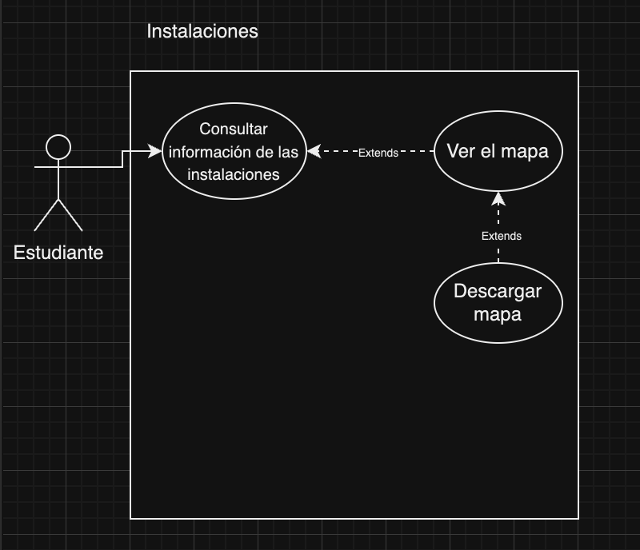
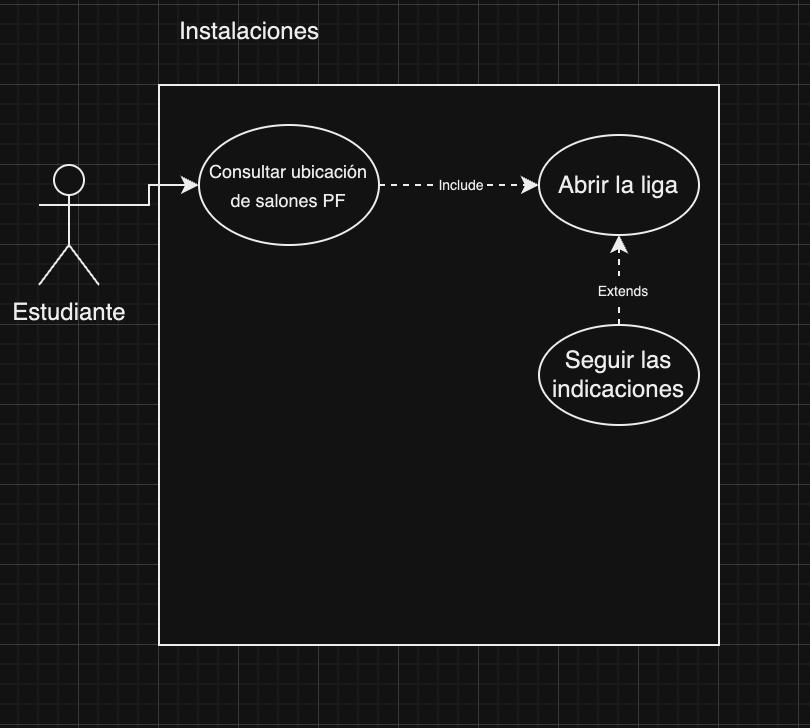
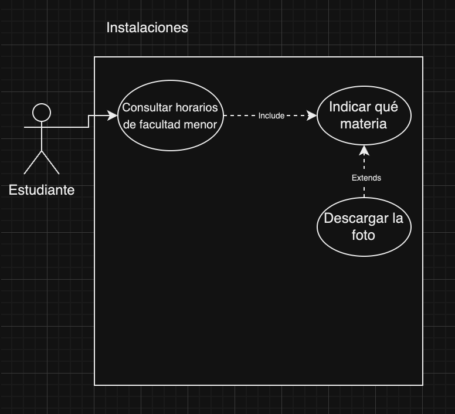
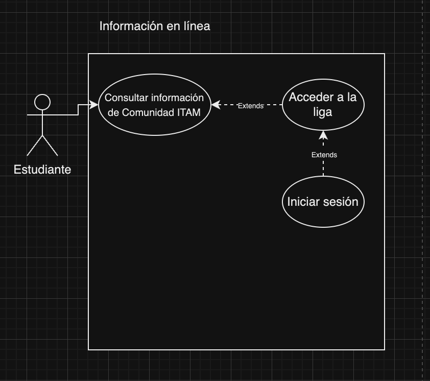
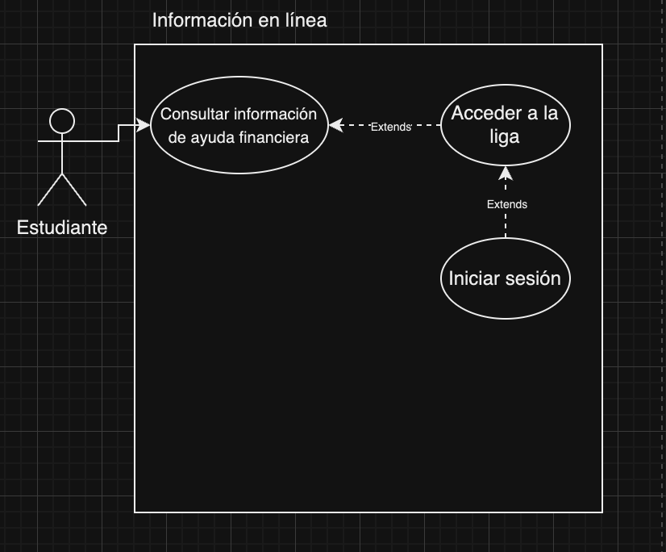
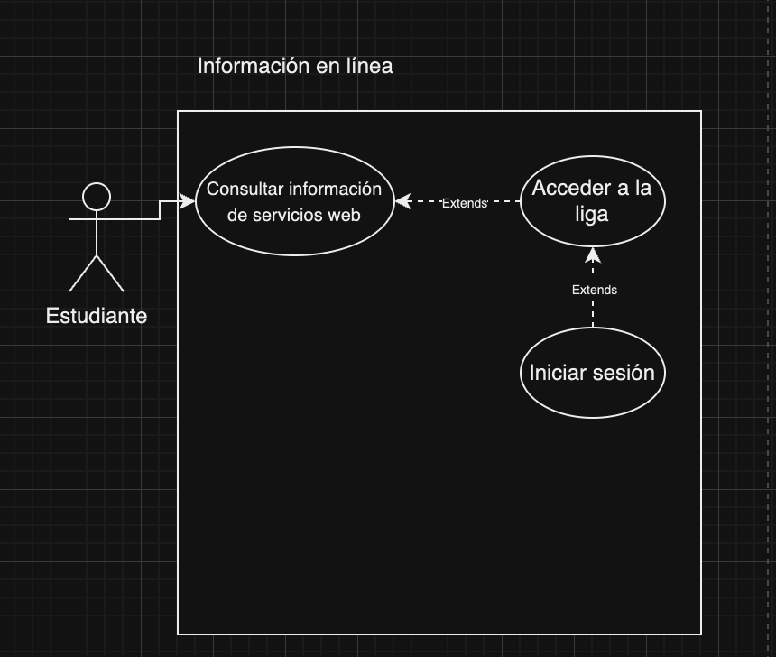
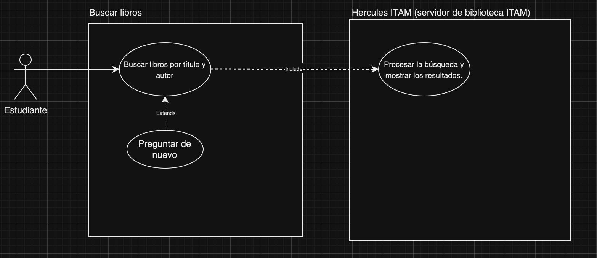
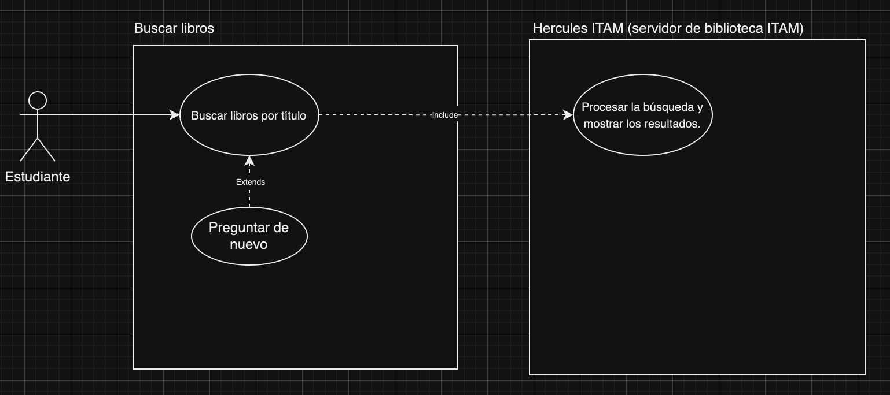

# ProyectoChatBotIS
Proyecto de Ingeniería de Software Otoño 2024. Chatbot para guiar a una persona que acaba de entrar al ITAM

## 1. Software Requirements (Requerimientos de Software)
Aquí defines las funcionalidades y características que debe cumplir el software. Incluyes al menos 3 casos de uso por requerimiento para mostrar cómo interactúan los usuarios con el sistema.

•⁠ **Requerimiento 1:** El sistema permite obtener información sobre las instalaciones.
  - Caso de Uso 1: Consultar información de las instalaciones
  - Caso de Uso 2: Consultar horarios de facultad menor
  - Caso de Uso 3: Consultar ubicación de salones PF

•⁠ **Requerimiento 2:** El sistema permite obtener enlaces a los servicios en línea que ITAM el proporciona.
  - Caso de Uso 1: Consultar información de servicios web
  - Caso de Uso 2: Consultar información de ayuda financiera
  - Caso de Uso 3: Consultar información de Comunidad ITAM

•⁠ **Requerimiento 3:** El sistema facilita la consulta de libros en el portal web de la biblioteca del ITAM
  - Caso de Uso 1: Consultar libros por nombre del libro
  - Caso de Uso 2: Consultar libros por nombre del libro y autor

